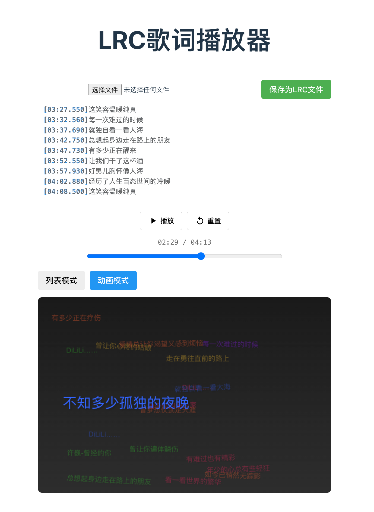

# LRC歌词播放器

一个基于 Vue 3 + TypeScript + Vite 开发的在线LRC歌词播放器，支持歌词编辑、预览和动画展示。

## 功能特点

- 支持 LRC 歌词格式的导入和导出
- 实时编辑和预览歌词
- 支持拖拽上传歌词文件
- 双模式歌词展示：
  - 列表模式：传统的滚动歌词显示
  - 动画模式：炫酷的Canvas动画效果
- 播放控制：播放/暂停、进度调整、重置
- 自动保存编辑内容
- 支持浅色/深色主题

## 技术栈

- Vue 3 + Composition API
- TypeScript
- Vite
- Canvas API

## 待实现功能

- [ ] 支持播放时快捷键插入时间戳
- [ ] 支持同步播放音频文件
